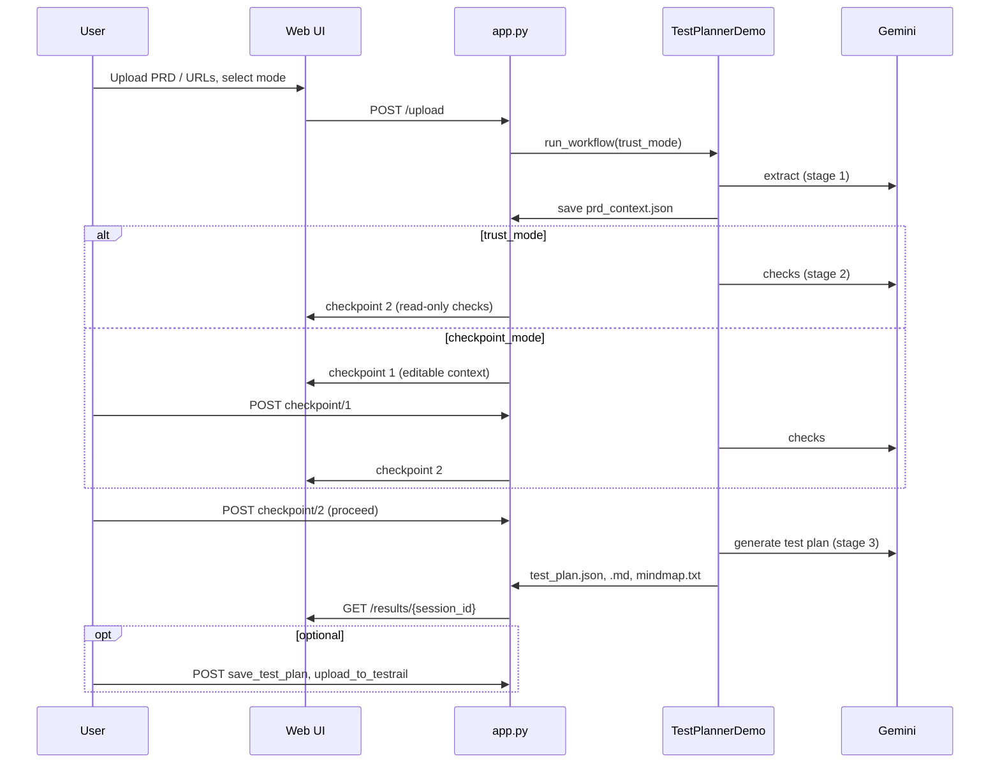
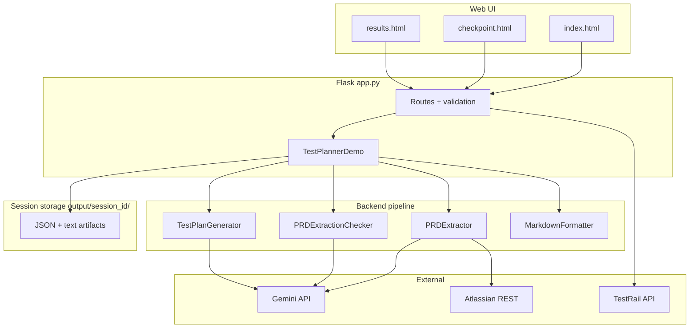

# QAgent port specification

**Version:** 0.1.0 (matches `pyproject.toml`)  
**Purpose:** Everything needed to reimplement QAgent’s design, functionality, and user flow in another repository.  
**Audience:** Engineers embedding QAgent as a feature module (backend-first or full-stack).

---

## Table of contents

1. [Executive summary](#1-executive-summary)
2. [Source code map](#2-source-code-map)
3. [Product behavior](#3-product-behavior)
4. [Architecture](#4-architecture)
5. [Workflow modes and state machine](#5-workflow-modes-and-state-machine)
6. [Pipeline stages](#6-pipeline-stages)
7. [Session artifacts](#7-session-artifacts)
8. [Data models](#8-data-models)
9. [HTTP API contract](#9-http-api-contract)
10. [Orchestrator (`TestPlannerDemo`)](#10-orchestrator-testplannerdemo)
11. [LLM integration](#11-llm-integration)
12. [Prompt library](#12-prompt-library)
13. [Atlassian ingestion](#13-atlassian-ingestion)
14. [TestRail export](#14-testrail-export)
15. [Security requirements](#15-security-requirements)
16. [Demo mode](#16-demo-mode)
17. [UI specification](#17-ui-specification)
18. [Dependencies and configuration](#18-dependencies-and-configuration)
19. [Embedding in another codebase](#19-embedding-in-another-codebase)
20. [Acceptance criteria for a faithful port](#20-acceptance-criteria-for-a-faithful-port)

---

## 1. Executive summary

QAgent is a **local-only** web app that turns PRDs (and optional Confluence/Jira context) into structured test plans using **Google Gemini** (`gemini-2.5-flash` by default).

Core design choices:

| Principle | Implementation |
|-----------|----------------|
| Multi-step pipeline | Decouple extraction → validation → generation → formatting to reduce LLM “lost in the middle” |
| Human-in-the-loop | **Checkpoint mode** pauses for review; **trust mode** auto-runs extraction + checks then still pauses at checks review |
| No database | All state in `output/{session_id}/` as JSON/text files |
| Structured I/O | Pydantic models + Gemini `response_mime_type: application/json` (+ schema where supported) |
| Prompt-driven quality | Behavior lives mainly in YAML under `backend/prompt_templates/` |

**Default UX today:** Trust-mode toggle is **hidden** in the upload form; when `trust_mode` is omitted from POST, the server treats it as **on** (`trust_mode = True`). Users always hit **checkpoint 2** (extraction checks review) before test plan generation.

---

## 2. Source code map

| Area | Path | Responsibility |
|------|------|----------------|
| Flask app + routes | `qagent/app.py` | HTTP layer, session dirs, `TestPlannerDemo` |
| Orchestration class | `qagent/app.py` → `TestPlannerDemo` | Workflow modes, checkpoints, file I/O |
| PRD extraction | `qagent/backend/prd_to_specs.py` → `PRDExtractor` | PDF/text load, Atlassian fetch, Gemini extract |
| Extraction checks | `qagent/backend/prd_extraction_checks.py` → `PRDExtractionChecker` | Completeness / hallucination / sufficiency |
| Test plan generation | `qagent/backend/generate_test_plan.py` → `TestPlanGenerator` | Mode-specific prompts → test plan JSON |
| Markdown export | `qagent/backend/json_to_md_formatter.py` → `MarkdownFormatter` | JSON → `.md` tables |
| TestRail upload | `qagent/backend/upload_to_testrail.py` → `TestRailUploader` | Sections + cases via TestRail API |
| Programmatic API (example) | `qagent/backend/apis.py` → `TestPlanningAPI` | Simpler pipeline without checkpoints |
| Security | `qagent/security_utils.py` | Session IDs, path safety, Atlassian URL allowlist |
| Token usage | `qagent/ai_usage.py` | JSONL usage + optional cost estimate |
| Prompts | `qagent/backend/prompt_templates/` | YAML + `team_notes/` |
| Templates | `qagent/templates/` | `index.html`, `checkpoint.html`, `results.html` |
| Static | `qagent/static/` | CSS, JS |
| Demo | `qagent/demo_mode.py` | Standalone demo app (legacy); production uses `app.py` demo flag |

**Line counts (order of magnitude):** ~1,850 `app.py`, ~7k core app+templates+backend — most complexity is UI and orchestration, not novel algorithms.

---

## 3. Product behavior

### 3.1 Inputs

| Input | Form field | Validation | Notes |
|-------|------------|------------|-------|
| PRD files | `prd_files` (multi) | Extensions: `.pdf`, `.txt`, `.md` | Optional if context URLs provided |
| Context URLs | `context_urls` | HTTPS Atlassian allowlist | Comma or newline separated |
| QA team | `qa_team` | String; loads `team_notes/{team}.txt` if in allowlist | UI currently only exposes `General` |
| Test plan mode | `test_plan_mode` | `release_acceptance` \| `dev_handoff` | Selects YAML prompt |
| Session name | `session_name` | UUIDv4 or `[A-Za-z0-9_-]{1,64}` | Optional; reuses/clears existing folder |
| Trust mode | `trust_mode` | Checkbox; off if `off`/`false`/`0` | **Hidden in UI**; defaults **on** when absent |

**Upload size:** `MAX_UPLOAD_BYTES` env (default 10 MiB), enforced by Flask `MAX_CONTENT_LENGTH`.

**At least one of:** valid PRD file(s) **or** non-empty context URLs.

### 3.2 Outputs

Per session directory:

- Structured PRD context JSON
- Extraction checks report JSON
- Test plan JSON + Markdown
- Optional mindmap text, combined PRD text, fetched context JSON
- `ai_usage.jsonl` (per Gemini call when not demo)

### 3.3 User journeys



---

## 4. Architecture



---

## 5. Workflow modes and state machine

### 5.1 Trust mode vs checkpoint mode

| Mode | `trust_mode` | After upload completes | Stops at |
|------|--------------|------------------------|----------|
| **Trust** (default) | `true` | Extract + run checks automatically | Checkpoint **2** (checks review, read-only) |
| **Checkpoint** | `false` | Extract only | Checkpoint **1** (PRD context, editable) |

**Neither mode** auto-generates the test plan without the user proceeding from checkpoint 2.

### 5.2 Checkpoints

| Step | `checkpoint` URL param | Content | Editable | Skip allowed |
|------|------------------------|---------|----------|--------------|
| 1 | `1` | `prd_context` JSON | Yes | Yes (`action=skip` → no edit applied) |
| 2 | `2` | `prd_extraction_checks` JSON | **No** (read-only UI) | No |

**POST `/checkpoint/<session_id>/<n>`** form fields:

- `content` — JSON string (required unless skipping)
- `action` — `proceed` (default) or `skip` (checkpoint 1 only; sets `content` to ignored)

### 5.3 `workflow_state.json` schema

Written/updated by `TestPlannerDemo`. Fields vary by stage:

```json
{
  "session_id": "32-char-hex-or-legacy-slug",
  "prd_file_path": "/path/to/combined_or_single_prd",
  "context_urls": ["https://..."],
  "output_dir": "/path/to/output/session_id",
  "current_step": 1,
  "prd_context": { "prd_context": { } },
  "prd_extraction_checks": { "prd_extraction_checks": { } },
  "combined_content_path": "/path/to/combined_prd_context.txt",
  "additional_notes": "team notes text",
  "qa_team": "General",
  "test_plan_mode": "release_acceptance",
  "trust_mode": true,
  "checks_reviewed": true,
  "checks_decision": "proceed",
  "test_plan": { "test_plan": { } },
  "demo_mode": true,
  "mock_test_plan": { }
}
```

| Field | When set |
|-------|----------|
| `current_step` | `1` after extract (checkpoint mode); `2` after checks or trust workflow |
| `combined_content_path` | When context URLs used (for checks grounding text) |
| `checks_reviewed` / `checks_decision` | On checkpoint 2 proceed |
| `test_plan` | After generation in `continue_checkpoint_workflow` |
| `demo_mode` / `mock_test_plan` | Demo workflow only |

### 5.4 State transitions (`continue_checkpoint_workflow`)

```
checkpoint POST 1 + content
  → optionally update prd_context.json
  → run PRDExtractionChecker
  → save prd_extraction_checks.json
  → return checkpoint 2 view

checkpoint POST 2 + content (ignored for edits)
  → set checks_reviewed / checks_decision
  → TestPlanGenerator (mode from test_plan_mode)
  → save test_plan.json, test_plan.md, mindmap.txt
  → redirect to /results/{session_id}
```

---

## 6. Pipeline stages

### Stage 1 — Extract (`PRDExtractor`)

**Class:** `qagent/backend/prd_to_specs.py`

**Entry points:**

- `extract_prd_from_file(prd_path, prompt_file, qa_team, team_notes, usage_log_path)`
- `extract_prd_with_context(prd_path?, context_urls, ..., save_context_path, save_combined_content_path, usage_log_path)`

**Prompt file:** `prd_reader.yaml` → key `prd_parsing_prompt`  
**Placeholders:** `{prd_content}`, `{qa_team}`, `{team_notes}`

**Gemini config:**

- `response_mime_type: application/json`
- `response_schema: PRDResponse` (Pydantic)
- `temperature: 0.1`
- Retries: 5, exponential backoff on `ResourceExhausted` (starts 5s)

**Output shape:** Top-level `{"prd_context": { ... }}` — saved as-is to `prd_context.json`.

**Multi-file PRDs:** App concatenates with `===== File: name =====` headers into `combined_prd.txt`.

**URL-only runs:** `prd_path` may be `None`; combined text is context sections only.

### Stage 2 — Validate (`PRDExtractionChecker`)

**Class:** `qagent/backend/prd_extraction_checks.py`

**Prompt file:** `prd_checks.yaml` → key `prd_extraction_checks_prompt`

**Inputs:**

- `prd_context` — inner object (zh_tw keys stripped before prompt)
- `combined_prd_text` — from `combined_prd_context.txt` or re-loaded PRD file

**Security:** User content wrapped in “untrusted” guards; braces escaped before `.format()`.

**Pass rule:** `sufficiency_for_tests.pass_check == true` iff `is_sufficient > 6` (0–10 scale).  
**Overall status:** `pass` or `warn` (informational; workflow does not block on failure).

**Output:** `{"prd_extraction_checks": { ... }}` → `prd_extraction_checks.json`

### Stage 3 — Generate (`TestPlanGenerator`)

**Class:** `qagent/backend/generate_test_plan.py`

**Prompt selection:**

| `test_plan_mode` | YAML file | YAML key |
|------------------|-----------|----------|
| `release_acceptance` | `release_acceptance.yaml` | `release_acceptance_test_generation_prompt` |
| `dev_handoff` | `dev_handoff.yaml` | `dev_handoff_test_generation_prompt` |

**Context building:** Loads `prd_context.json`, strips `*_zh_tw` fields, builds `prompt_context` dict (project name, user stories as bullet lists, tech specs, `additional_notes` from workflow).

**Gemini config:** JSON mode, `temperature: 0.1`, Pydantic validate `TestPlanResponse` (falls back to raw dict on validation failure).

**Side effects:**

- `mindmap_outline` in response → unescape `\n`/`\t` → `mindmap.txt`
- `MarkdownFormatter.convert_test_plan_json_to_md` → `test_plan.md`

### Stage 4 — Format (`MarkdownFormatter`)

**Class:** `qagent/backend/json_to_md_formatter.py`

Markdown tables per sub-feature. **Note:** Rationale column reads `case.get("Rationale / Business Impact")` but schema field is `additional_notes` — rationale column may be empty unless LLM uses the alias.

---

## 7. Session artifacts

Base path: `{OUTPUT_ROOT}/{session_id}/` (default `output/` relative to cwd).

| File | Stage | Required for results | Description |
|------|-------|---------------------|-------------|
| `prd_context.json` | 1 | **Yes** | Full extractor response |
| `prd_extraction_checks.json` | 2 | No | Checks report |
| `workflow_state.json` | ongoing | No | Orchestration state |
| `combined_prd_context.txt` | 1 | No | Source text for checks |
| `combined_prd.txt` | upload | No | Multi-file PRD merge |
| `fetched_context_data.json` | 1 | No | Raw Atlassian fetch array |
| `test_plan.json` | 3 | No | Generated plan |
| `test_plan.md` | 3 | No | Rendered markdown |
| `mindmap.txt` | 3 | No | MindMeister-style outline |
| `ai_usage.jsonl` | all LLM | No | One JSON object per line per call |
| Uploaded PRD copies | upload | No | Original filenames in session dir |

**Session listing:** Sessions appear in UI if folder contains any of: `prd_context.json`, `prd_extraction_checks.json`, `workflow_state.json`, `test_plan.json`, `test_plan.md`.

---

## 8. Data models

Canonical definitions are Pydantic models in backend modules. JSON on disk matches Gemini responses.

### 8.1 `ExtractedPRDContext` (inner of `prd_context`)

```typescript
// Conceptual TypeScript — implement as Pydantic/dataclasses in target stack
interface TechSpecs {
  system_interactions: string[];
  system_interactions_zh_tw?: string[];
  data_models_or_schemas: string[];
  data_models_or_schemas_zh_tw?: string[];
  api_endpoints: string[];
  api_endpoints_zh_tw?: string[];
  authentication_and_authorization: string[];
  authentication_and_authorization_zh_tw?: string[];
}

interface OtherDataForTesting {
  acceptance_criteria: string[];
  dependencies_and_integrations: string[];
  known_limitations_or_risks: string[];
  success_metrics: string[];
}

interface ExtractedPRDContext {
  project_name: string;
  target_feature_summary: string;
  target_feature_summary_zh_tw?: string;
  core_user_stories: string[];
  core_user_stories_zh_tw?: string[];
  developer_user_stories?: string[];
  developer_user_stories_zh_tw?: string[];
  technical_specifications: TechSpecs;
  other_contextual_data: OtherDataForTesting;
}

// File root:
interface PRDContextFile {
  prd_context: ExtractedPRDContext;
}
```

### 8.2 `PRDExtractionChecks`

```typescript
interface CompletenessIssue {
  field: string;
  issue: string;
  severity: "high" | "medium" | "low";
  evidence_snippets: string[];
}

interface HallucinationFinding {
  statement: string;
  verdict: "grounded" | "not_found" | "unclear";
  evidence_snippets: string[];
  notes: string;
}

interface SufficiencyGap {
  area: string;
  needed_info: string;
  why_needed: string;
  severity: "high" | "medium" | "low";
}

interface SufficiencyAssessment {
  is_sufficient: number; // 0-10
  pass_check: boolean;   // true iff is_sufficient > 6
  gaps: SufficiencyGap[];
  summary: string;
}

interface PRDExtractionChecks {
  overall_status: "pass" | "warn";
  completeness: CompletenessIssue[];
  hallucinations: HallucinationFinding[];
  sufficiency_for_tests: SufficiencyAssessment;
  summary: string;
}

interface PRDExtractionChecksFile {
  prd_extraction_checks: PRDExtractionChecks;
}
```

### 8.3 `TestPlan`

```typescript
interface TestCase {
  test_case_id: string;
  test_scenario: string;
  test_steps: string[];
  expected_result: string[];
  additional_notes: string;
  test_type: string;
  priority: string; // e.g. P0, P1, P2
}

interface TestCasesForSubFeature {
  sub_feature: string;
  test_cases: TestCase[];
}

interface TestPlan {
  test_plan_id: string;
  feature: string;
  objective: string;
  preconditions: string[];
  mindmap_outline?: string;
  sub_feature_tests: TestCasesForSubFeature[];
}

interface TestPlanFile {
  test_plan: TestPlan;
}
```

---

## 9. HTTP API contract

All routes are in `qagent/app.py`. Session IDs in URLs are validated and canonicalized to UUIDv4 hex when applicable.

### 9.1 Route table

| Method | Path | Purpose |
|--------|------|---------|
| GET | `/` | Upload form + session picker |
| POST | `/upload` | Start workflow (`multipart/form-data`) |
| GET/POST | `/checkpoint/<session_id>/<checkpoint>` | Review step 1 or 2 |
| GET | `/results/` | Redirect if missing `session_id` |
| GET | `/results/<session_id>` | Results page |
| GET | `/download/<session_id>/<file_type>` | Attachment download |
| POST | `/save_test_plan/<session_id>` | JSON body; same-origin required |
| POST | `/upload_to_testrail/<session_id>` | JSON body; same-origin required |
| GET | `/health` | Liveness + backend flags |

### 9.2 `POST /upload`

**Content-Type:** `multipart/form-data`

| Field | Type | Required |
|-------|------|----------|
| `prd_files` | file[] | No* |
| `context_urls` | string | No* |
| `qa_team` | string | No (default `General`) |
| `test_plan_mode` | string | No (default `release_acceptance`) |
| `session_name` | string | No |
| `trust_mode` | string | No (default on) |

\* At least one valid file or URL required.

**Success responses:**

- Renders `checkpoint.html` with `checkpoint_step` 1 or 2
- Or redirects to `results` (rare; only if workflow returns without checkpoint)

**Errors:** Flash message + redirect to `/`.

### 9.3 `POST /save_test_plan/<session_id>`

**Headers:** `Content-Type: application/json`, `Origin` must match host (CSRF).

**Body:**

```json
{
  "content": "<stringified JSON of TestPlanFile>"
}
```

**Response:**

```json
{ "success": true, "message": "...", "updated_content": "..." }
```

**Side effects:** Overwrites `test_plan.json`, regenerates `test_plan.md`.

### 9.4 `POST /upload_to_testrail/<session_id>`

**Body:**

```json
{
  "project_id": 123,
  "suite_id": 456,
  "delete_existing": false
}
```

**Env required:** `TESTRAIL_URL`, `TESTRAIL_USER`, `TESTRAIL_PASSWORD_OR_KEY`

**Success:**

```json
{
  "success": true,
  "message": "...",
  "testrail_url": "https://.../index.php?/suites/view/{suite_id}",
  "project_id": 123,
  "suite_id": 456
}
```

### 9.5 `GET /download/<session_id>/<file_type>`

| `file_type` | File |
|-------------|------|
| `prd_context` | `prd_context.json` |
| `prd_extraction_checks` | `prd_extraction_checks.json` |
| `test_plan_json` | `test_plan.json` |
| `test_plan_md` | `test_plan.md` |
| `mindmap_txt` | `mindmap.txt` |
| `fetched_context_data` | `fetched_context_data.json` |

### 9.6 `GET /health`

```json
{
  "status": "healthy",
  "backend_available": true,
  "planner_available": true,
  "demo_mode": false
}
```

### 9.7 Response headers (all routes)

Set on every response: `X-Content-Type-Options: nosniff`, `X-Frame-Options: DENY`, `Referrer-Policy: no-referrer`.

---

## 10. Orchestrator (`TestPlannerDemo`)

**Location:** `qagent/app.py`

| Method | Role |
|--------|------|
| `run_workflow(...)` | Dispatches demo / trust / checkpoint |
| `_run_trust_workflow` | Extract → checks → return checkpoint 2 payload |
| `_run_checkpoint_workflow` | Extract → return checkpoint 1 payload |
| `continue_checkpoint_workflow(session_id, checkpoint, content)` | Advance 1→2 or 2→results |
| `_run_prd_checks` | Load YAML, call checker (mock if demo) |
| `_load_combined_prd_text` | Prefer `combined_content_path`, else PRD file |
| `_run_demo_workflow` | Mock data from `demo_mode.create_mock_data` |

**Initialization:** Requires `GEMINI_API_KEY` for live mode; missing key → `demo_mode = True` on planner instance.

**Simpler API (no checkpoints):** `qagent/backend/apis.py` → `TestPlanningAPI.run_complete_workflow` runs extract → generate → markdown only (skips checks stage).

---

## 11. LLM integration

| Setting | Value |
|---------|--------|
| SDK | `google-generativeai` |
| Default model | `gemini-2.5-flash` |
| API key env | `GEMINI_API_KEY` |
| Pricing estimate env | `GEMINI_MODEL_PRICING_JSON` (optional) |

**Usage logging** (`ai_usage.jsonl` per session):

```json
{
  "ts": 1710000000,
  "provider": "google.generativeai",
  "model": "models/gemini-2.5-flash",
  "model_normalized": "gemini-2.5-flash",
  "operation": "prd_extract | prd_extraction_checks | test_plan_generate",
  "prompt_tokens": 1000,
  "output_tokens": 500,
  "total_tokens": 1500,
  "estimated_cost_usd": 0.001,
  "prompt_len": 12000
}
```

**Input size limits (checks):** `combined_prd_text` and serialized `prd_context` each max **200,000** characters.

---

## 12. Prompt library

**Canonical copies for porting:** `docs/porting/prompts/`

| File | Key | Stage |
|------|-----|-------|
| `prd_reader.yaml` | `prd_parsing_prompt` | Extract |
| `prd_checks.yaml` | `prd_extraction_checks_prompt` | Validate |
| `release_acceptance.yaml` | `release_acceptance_test_generation_prompt` | Generate |
| `dev_handoff.yaml` | `dev_handoff_test_generation_prompt` | Generate |

**Team notes:** When `qa_team` is one of `AEP`, `AIRIS`, `AIQUA`, `BotBonnie`, `CD`, `OJM`, `REC`, `SDK`, app loads `team_notes/{qa_team}.txt` into `additional_notes` for extraction (and passes through to generation via workflow state).

**Do not paraphrase prompts in the port** — copy YAML verbatim to preserve output quality.

---

## 13. Atlassian ingestion

**Auth:** HTTP Basic — `ATLASSIAN_EMAIL` + `ATLASSIAN_API_TOKEN` (required when using context URLs).

**URL validation** (`security_utils.validate_atlassian_base_url`):

- Scheme must be `https`
- Host must end with `.atlassian.net` OR appear in `ATLASSIAN_ALLOWED_DOMAINS` (CSV env)
- IP literals rejected

**Confluence:** `GET {base}/wiki/api/v2/pages/{page_id}?body-format=atlas_doc_format`  
Page ID from `/pages/(\d+)/` or path segment after `/wiki/`.

**Jira:** `GET {base}/rest/api/3/issue/{KEY}?fields=summary,description,comment`  
Key from `/browse/([A-Z]+-\d+)`.

**ADF handling:** Recursive text extraction from Atlassian Document Format JSON (`extract_text_from_adf`).

**Saved raw fetch:** `fetched_context_data.json` — array of per-URL result objects (including `error` entries).

---

## 14. TestRail export

**Module:** `qagent/backend/upload_to_testrail.py`  
**Depends on:** `qagent/backend/testrail.py` (vendor API client)

**Mapping:**

- Each `sub_feature` → TestRail **section** (create if missing)
- Each `test_case` → **case** in that section
- `priority`: P0→4, P1→3, P2→2, P3→1
- `type_id`: fixed `7`
- `labels`: `[test_type]`
- Steps: `custom_steps_separated` when step/result counts match; else `custom_steps` + `custom_expected`
- Plan-level `preconditions` joined into each case’s `custom_preconds`

**Delete option:** If `delete_existing: true`, `delete_all_sections()` on suite before upload (destructive; UI double-confirms).

---

## 15. Security requirements

Preserve when embedding:

| Control | Implementation |
|---------|------------------|
| Secret key | `FLASK_SECRET_KEY` required at startup (no default) |
| Session ID | UUIDv4 (canonical hex) or legacy slug regex |
| Path traversal | `safe_session_dir()` — resolved path must stay under output root |
| Upload types | Whitelist extensions; `secure_filename()` |
| Atlassian URLs | HTTPS + domain allowlist |
| CSRF on JSON POSTs | `_require_same_origin_json()` — validate `Origin` header |
| Upload size cap | `MAX_UPLOAD_BYTES` / `MAX_CONTENT_LENGTH` |
| Prompt injection mitigation | Checks stage wraps user content as untrusted; brace escaping |
| Logging | Truncate sensitive strings (`_safe_str`); never log API keys |

**Operational policy** (from product README): local-only use; enterprise Gemini keys; redact secrets in PRDs.

---

## 16. Demo mode

**Triggers:**

- Missing `GEMINI_API_KEY` at planner init
- Backend import/init failure

**Behavior:**

- `PRDExtractionChecker.create_mock_report()` for checks
- `demo_mode.create_mock_data()` reads sample files from `output/d1e2m3o4/` (fragile if missing)
- Checkpoint flow uses simplified file writes; checkpoint 2 writes mock `test_plan.json`

**Health endpoint** exposes `demo_mode` boolean.

---

## 17. UI specification

### 17.1 Pages

| Template | Route | Key elements |
|----------|-------|--------------|
| `index.html` | `/` | Upload form, previous session dropdown, mode/team selectors |
| `checkpoint.html` | `/checkpoint/...` | JSON textarea, proceed/skip, progress indicator, processing overlay on POST |
| `results.html` | `/results/...` | Tabs: PRD context, checks, editable test plan, JSON/raw, mindmap; save + TestRail modals |

### 17.2 Results page — save payload

Client builds:

```json
{
  "test_plan": {
    "test_plan_id": "...",
    "feature": "...",
    "objective": "...",
    "preconditions": ["..."],
    "sub_feature_tests": [
      {
        "sub_feature": "...",
        "test_cases": [
          {
            "test_case_id": "...",
            "test_type": "Functional",
            "priority": "P1",
            "test_scenario": "...",
            "test_steps": ["..."],
            "expected_result": ["..."],
            "additional_notes": "..."
          }
        ]
      }
    ]
  }
}
```

Stringified into `POST /save_test_plan` as `{ "content": "<json string>" }`.

### 17.3 Styling

Bootstrap 5.1.3 + Font Awesome 6 + `static/css/style.css`. No build step.

---

## 18. Dependencies and configuration

### 18.1 Python packages (`pyproject.toml`)

- Flask ≥3.1, Werkzeug, Jinja2
- `google-generativeai`, `pydantic`, `PyPDF2`, `pyyaml`, `requests`, `python-dotenv`
- Python **≥3.12**

### 18.2 Environment variables

| Variable | Required | Purpose |
|----------|----------|---------|
| `FLASK_SECRET_KEY` | **Yes** | Flask sessions / flash |
| `GEMINI_API_KEY` | For AI | Live pipeline |
| `ATLASSIAN_EMAIL` | For URLs | Confluence/Jira |
| `ATLASSIAN_API_TOKEN` | For URLs | Confluence/Jira |
| `ATLASSIAN_ALLOWED_DOMAINS` | No | Extra allowed hostnames (CSV) |
| `TESTRAIL_URL` | For export | TestRail base URL |
| `TESTRAIL_USER` | For export | TestRail user |
| `TESTRAIL_PASSWORD_OR_KEY` | For export | API key/password |
| `MAX_UPLOAD_BYTES` | No | Default 10485760 |
| `LOG_LEVEL` | No | Default INFO |
| `GEMINI_MODEL_PRICING_JSON` | No | Cost lines in `ai_usage.jsonl` |

---

## 19. Embedding in another codebase

### 19.1 Recommended integration layers

```text
┌─────────────────────────────────────────┐
│  Host app UI (your framework)           │
├─────────────────────────────────────────┤
│  Session / storage adapter              │  ← map output/{id}/ to your blob store or DB
├─────────────────────────────────────────┤
│  QAgent orchestration (port of          │
│  TestPlannerDemo + 4 pipeline classes)  │
├─────────────────────────────────────────┤
│  Prompt + schema bundle (verbatim)      │
└─────────────────────────────────────────┘
```

### 19.2 Minimum viable port (backend)

1. Copy or reimplement: `PRDExtractor`, `PRDExtractionChecker`, `TestPlanGenerator`, `MarkdownFormatter`
2. Copy `docs/porting/prompts/*.yaml` and team notes
3. Implement session artifact I/O with your storage backend
4. Expose host-native API equivalent to `/upload` + `/checkpoint` + `/results` data
5. Wire `GEMINI_API_KEY` and optional Atlassian/TestRail env vars

### 19.3 Full parity port

Add: checkpoint UI, results editor (`buildTestPlanFromUI` logic), downloads, TestRail modal, security utils, usage JSONL, health check.

### 19.4 Files to copy verbatim vs rewrite

| Copy verbatim | Reimplement to host patterns |
|---------------|----------------------------|
| `prompt_templates/**` | `app.py` routes → your router |
| Pydantic models (or generate JSON Schema) | Jinja templates → your UI |
| `security_utils.py` | Flask-specific CSRF → your auth |
| `ai_usage.py` | File paths → your storage |
| `upload_to_testrail.py` + `testrail.py` | Optional if TestRail not needed |

### 19.5 Suggested module boundary in host repo

```text
your_app/
  qagent/
    pipeline/       # extractor, checker, generator, formatter
    prompts/        # from docs/porting/prompts
    orchestration/  # workflow + state machine
    integrations/   # atlassian, testrail
    schemas/        # pydantic models
```

---

## 20. Acceptance criteria for a faithful port

Use these to verify the integration before shipping:

### 20.1 Functional

- [ ] Upload PRD only → `prd_context.json` validates against schema
- [ ] Upload Confluence + Jira URLs only (no file) → extraction succeeds when credentials set
- [ ] Invalid Atlassian URL → error captured in `fetched_context_data` or request rejected
- [ ] Checkpoint 1: edited JSON persisted to `prd_context.json` and used for checks
- [ ] Checkpoint 2: read-only; proceed triggers test plan generation
- [ ] `release_acceptance` vs `dev_handoff` produce different plan tone/structure (smoke test)
- [ ] `test_plan.md` regenerates after save
- [ ] Session resume: list sessions with partial artifacts

### 20.2 Security

- [ ] Path `../../../etc/passwd` as session ID rejected
- [ ] Non-allowlisted URL host rejected
- [ ] Cross-origin `POST` to save/testrail without matching `Origin` → 403

### 20.3 Operational

- [ ] Missing `GEMINI_API_KEY` → demo mode or clear error (match product policy)
- [ ] `ai_usage.jsonl` appended per LLM call in live mode
- [ ] Upload over size limit → 413

### 20.4 Optional integrations

- [ ] TestRail upload creates sections per sub-feature
- [ ] `delete_existing: true` only after explicit user confirmation

---

## Appendix A — `check_api_keys` and planner availability

```python
# Returns list of missing key names; empty list = live mode possible
missing = check_api_keys()  # currently only checks GEMINI_API_KEY
```

`PLANNER_AVAILABLE` is false if `TestPlannerDemo()` raises at import time.

## Appendix B — QA team allowlist (upload handler)

```python
qa_teams = ["AEP", "AIRIS", "AIQUA", "BotBonnie", "CD", "OJM", "REC", "SDK"]
```

## Appendix C — Related diagrams in repo

- `high-level.md` — component flow
- `qagent/design.md` — detailed user/data flow

---

*End of port specification.*
